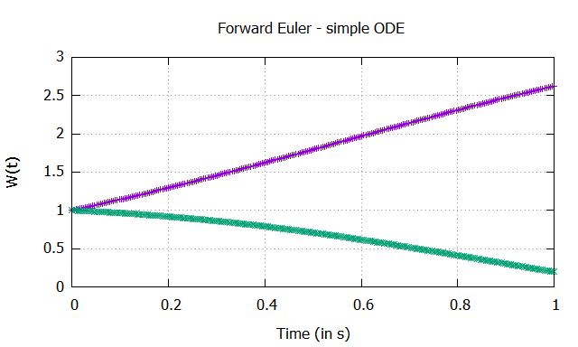
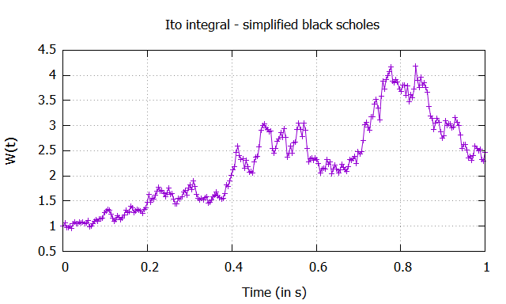
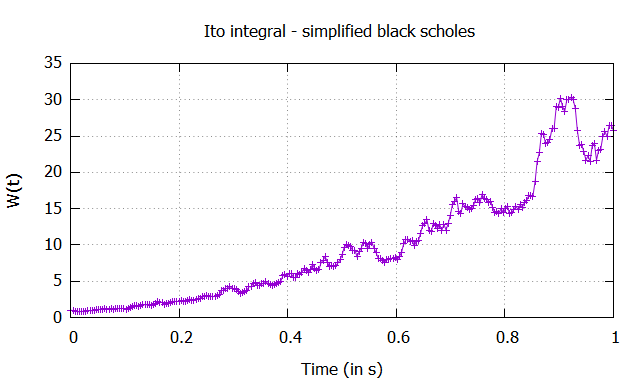

# CMake编译并使用SDE Library
A CMake demo. using CMake to compile a [C++ Stochastic Differential Equation solver](https://github.com/architgupta93/SDE) library to .dll file and test its implement it in project。

## 环境

本篇博客所要做的是：Windows环境使用CMake编译一个开源C++库，这个库所有.h头文件和.cpp源文件都已经提供给用户了，将这个库编译为动态链接库.dll文件。然后在不用重新编译库的情况下，使用CMake包含这个.dll库并测试.exe可执行文件。

下载安装以下工具：

- MinGW x86位，用于C++编译器
- cmake [cmake-3.20.3-windows-x86_64.msi](https://github.com/Kitware/CMake/releases/download/v3.20.3/cmake-3.20.3-windows-x86_64.msi)
- git **[64-bit Git for Windows Setup](https://github.com/git-for-windows/git/releases/download/v2.31.1.windows.1/Git-2.31.1-64-bit.exe).**
- gnuplot绘图包，Windows安装包 [ (MinGW) ](http://tmacchant3.starfree.jp/gnuplot/Eng/winbin/)版本，可执行文件加入环境变量path
- SDE开源项目，git 位置为：`git clone git@github.com:architgupta93/SDE.git`

## 项目修改

由于这个SDE library有一些bug，因此需要手动更正。

- ``common_functions.h``和``common_functions.cpp``文件与整个SDE library无关，因此被我移动到./external文件夹。

- 修改了header文件和source文件 #include包含宏命令，明确到头文件的位置。如果下面几步存在问题，可以回头来看是否出现这些问题：

  > ./src/models/HodgkinHuxley.h 文件`#include "SDE.h"` -> `#include "../SDE.h"`./src/examples/simple_ode.h文件 `#include "SDE.h"`->`#include "../SDE.h"`./src/XXX.h 文件`#include "HodgkinHuxley.h"`->`#include "models/HodgkinHuxley.h"`
  >
  > ./src/examples/sde_black_scholes.cpp文件 `#include "HodgkinHuxley.h"`->`#include "../models/HodgkinHuxley.h"`
  >
  > ./src/examples/sde_black_scholes.cpp文件 `#include "SDE.h"`->`#include "../SDE.h"`

- ……

经过以上调整，编译不报错即可利用CMake编译。

## 编译.dll文件并确保它能正常使用

本小节编译整个SDE库，形成一个shared动态链接库。由于要保证它能使用，因此这个project包含两部分，第一部分编译shared库（.dll），第二部分编译可执行文件（.exe）。

在./根目录下创建CMakeLists.txt文件，第一部分用于生成.dll文件，主要用到 `add_library`命令；第二部分用于生成.exe文件，主要用到 `add_executable`命令；第三部分需要使得生成的可执行文件包含前面生成的库，主要用到``target_link_libraries``命令。完整的文件如下：

```cmake
cmake_minimum_required (VERSION 3.8)

project (getSDELibs)
# 设置.exe的文件名
set(EXE_NAME "testSDE01")
# # 设置.dll的生成位置，默认是和bin相同
# set(LIBRARY_OUTPUT_PATH ${PROJECT_SOURCE_DIR}/lib)

# 查找src所有子文件夹里的.cpp文件
file(GLOB LIB_SRC
	"src/*.cpp"
	"src/models/*.cpp"
)
# # add_subdirectory(src)

# 1. 编译一个动态链接库
add_library(SDE SHARED ${LIB_SRC})
# 需要包含头文件路径
target_include_directories(SDE
	PUBLIC 
		${PROJECT_SOURCE_DIR}/src/models
		${PROJECT_SOURCE_DIR}/src
)

# 2. 编译一个测试使用的SDE函数
add_executable(${EXE_NAME} "src/examples/simple_sde.cpp")
# 需要包含头文件路径
target_include_directories(${EXE_NAME}
	PUBLIC 
		${PROJECT_SOURCE_DIR}/src/models
		${PROJECT_SOURCE_DIR}/src
)
# 3. 包含已经编译好的动态链接库
target_link_libraries(${EXE_NAME} SDE)
# # 可执行文件目录必须直接存在.dll文件，否则将无法运行
# file(COPY ${SDE} DESTINATION ${CMAKE_BINARY_DIR})

```

运用cmake编译程序一般有以下三步：

1. 创建./build/空文件夹，进入空文件夹打开git cmd界面，然后运行以下命令：正常（足够幸运）的话，就可以编译成功：

``cmake -G "MinGW Makefiles" ../``

2. 然后make，就可以编译生成.dll和.exe文件:

``make``

3. 最后确保它能正常使用，

``./testSDE01.exe``

如果执行一遍畅通完好，就会有以下运行记录：




文件夹结构

```
├─build
│  └─CMakeFiles
│      ├─3.20.2
│      ├─CMakeTmp
│      ├─SDE.dir
│      └─testSDE01.dir
├─external
└─src
    ├─examples
    └─models
```


## 测试使用.dll文件

本小节使用动态链接库libSDE.dll及其头文件，测试一个它的example。

下面调整程序的结构，把动态链接库移动到./lib文件夹下，把./src文件夹下所有.cpp删除，只保留#include所需要的.h头文件。目标是，利用cmake编译一个example，使用.dll头文件，而不需要使用SDE library的重新编译。


下面编写CMakeLists.txt，仍然需要两步，第一步用于生成.exe文件，主要用到 `add_executable`命令；第二部分需要使得生成的可执行文件包含查找到的库，主要用到``target_link_libraries``命令。文件如下：

```cmake
cmake_minimum_required (VERSION 3.8)

project (getSDELibs)
# 设置.exe的文件名
set(EXE_NAME "testSDE02")
# 设置.dll的生成位置，默认是和bin相同
 set(LIBRARY_OUTPUT_PATH ${PROJECT_SOURCE_DIR}/lib)

# 查找src所有子文件夹里的.cpp文件
file(GLOB LIB_SRC
	"src/*.cpp"
	"src/models/*.cpp"
)

# # find_library(SDE "libSDE.dll" PATHS "${PROJECT_SOURCE_DIR}/lib")

# 由于实在查找不到libSDE.dll，因此采用直接设定文件位置的方法
set(SDE "${PROJECT_SOURCE_DIR}/lib/libSDE.dll")

# 1. 编译一个测试使用的SDE函数
add_executable(${EXE_NAME} "src/examples/sde_black_scholes.cpp")
# 需要包含头文件路径
target_include_directories(${EXE_NAME}
	PUBLIC 
		${PROJECT_SOURCE_DIR}/src/models
		${PROJECT_SOURCE_DIR}/src
)
# 2. 包含指定好位置的动态链接库
target_link_libraries(${EXE_NAME} ${SDE})
# 可执行文件目录必须直接存在.dll文件，否则将无法运行
file(COPY ${SDE} DESTINATION ${CMAKE_BINARY_DIR})

```

如果正常，运行的结果如下所示，可见make的过程显然缩短了：


测试.exe程序，可以发现运行结果不一样，显然是符合SDE的特性。





